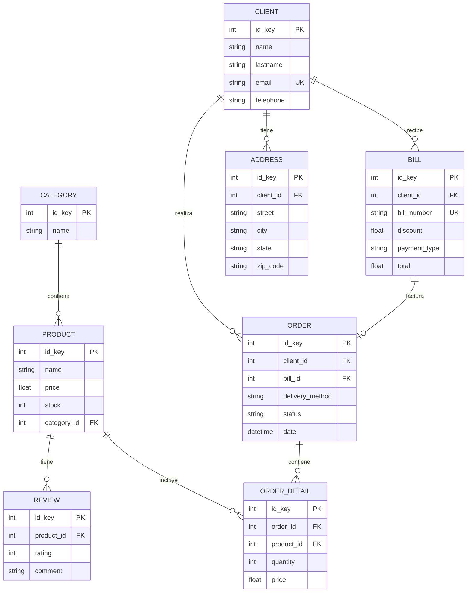

# 🚀 Plataforma E-commerce Timba-SA

<div align="center">


**Sistema E-commerce Full-Stack de Nivel Empresarial**

*Alto Rendimiento • Listo para Producción • Escalable • UI Moderna*

[Inicio Rápido](#-inicio-rápido) •
[Arquitectura](#-arquitectura) •
[Características](#-características) •
[Documentación](#-documentación) •
[Desarrollo](#-desarrollo)

</div>

---

## 📋 Tabla de Contenidos

- [Descripción General](#-descripción-general)
- [Características Principales](#-características-principales)
- [Stack Tecnológico](#-stack-tecnológico)
- [Arquitectura](#-arquitectura)
- [Inicio Rápido](#-inicio-rápido)
- [Estructura del Proyecto](#-estructura-del-proyecto)
- [API Backend](#-api-backend)
- [Aplicación Frontend](#-aplicación-frontend)
- [Esquema de Base de Datos](#-esquema-de-base-de-datos)
- [Rendimiento](#-rendimiento)
- [Configuración](#-configuración)
- [Testing](#-testing)
- [Despliegue](#-despliegue)
- [Contribuir](#-contribuir)

---

## 🎯 Descripción General

Una **plataforma e-commerce full-stack completa** construida con tecnologías modernas y mejores prácticas. Este sistema combina un backend FastAPI de alto rendimiento con un hermoso frontend React, diseñado para manejar **más de 400 usuarios concurrentes** con tiempos de respuesta menores a 200ms.

### ¿Qué lo Hace Especial?

- 🏗️ **Solución Full-Stack**: API backend completa + SPA moderna en React
- 🚀 **Listo para Producción**: Probado en batalla con pruebas de carga (400 usuarios concurrentes)
- 💾 **Caché Inteligente**: Integración con Redis con mejora de rendimiento del 60-70%
- 🎨 **UI Moderna**: Tema Cyber-Dark con glassmorphism y animaciones suaves
- 🔒 **Seguridad Empresarial**: Rate limiting, validación de entrada, prevención de inyección SQL
- 📊 **Monitoreo en Tiempo Real**: Métricas de salud en vivo y dashboard de observabilidad
- 🧪 **Testing Completo**: Más de 189 tests con cobertura >80%
- 🐳 **Containerizado**: Setup completo de Docker para desarrollo y producción

### Casos de Uso

- **Plataformas E-commerce**: Catálogo completo de productos, carrito de compras, gestión de pedidos
- **Sistemas de Retail**: Productos multi-categoría, perfiles de clientes, seguimiento de inventario
- **Procesamiento de Pedidos**: Ciclo de vida completo del pedido desde el carrito hasta la entrega
- **Dashboards de Administración**: Métricas del sistema en tiempo real y monitoreo de rendimiento

---

## ✨ Características Principales

### Capacidades del Backend

#### **Gestión de Productos**
- ✅ Operaciones CRUD completas con paginación
- ✅ Organización por categorías
- ✅ Gestión de stock en tiempo real
- ✅ Caché Redis (TTL de 5 minutos)
- ✅ Reseñas y calificaciones de productos
- ✅ Validación de precios y restricciones

#### **Gestión de Clientes**
- ✅ Perfiles de cliente con validación única de email
- ✅ Gestión de múltiples direcciones por cliente
- ✅ Seguimiento completo del historial de pedidos
- ✅ Manejo de eliminación en cascada

#### **Procesamiento de Pedidos**
- ✅ Carrito de compras multi-item
- ✅ Validación de llaves foráneas
- ✅ Múltiples métodos de entrega (Drive-thru, En mano, Domicilio)
- ✅ Seguimiento de estado del pedido (Pendiente, En Progreso, Entregado, Cancelado)
- ✅ Deducción y restauración de stock

#### **Sistema de Facturación**
- ✅ Generación de números de factura únicos
- ✅ Gestión de descuentos
- ✅ Múltiples tipos de pago (Efectivo, Tarjeta)
- ✅ Cálculo automático de totales

### Características de Rendimiento

- 🚀 **Connection Pooling**: 50 conexiones base + 100 overflow por worker
- 🚀 **Arquitectura Multi-Worker**: 4-8 workers de Uvicorn para paralelismo
- 🚀 **Caché Redis**: Patrón cache-aside con auto-invalidación
- 🚀 **Indexación de Base de Datos**: Índices optimizados en llaves foráneas
- 🚀 **Lazy Loading**: Previene problemas de consultas N+1

### Características de Seguridad

- 🔒 **Rate Limiting**: 100 solicitudes/60 segundos por IP (basado en Redis)
- 🔒 **Validación de Entrada**: Esquemas Pydantic con reglas completas
- 🔒 **Prevención de Inyección SQL**: Consultas parametrizadas vía ORM
- 🔒 **Configuración CORS**: Políticas de origen cruzado configurables
- 🔒 **Manejo de Errores**: Degradación elegante

### Observabilidad

- 📊 **Health Checks**: Métricas de base de datos, Redis y pool de conexiones
- 📊 **Logging Centralizado**: Logs rotativos con IDs de solicitud
- 📊 **Métricas de Rendimiento**: Tiempos de respuesta, tasas de acierto de caché
- 📊 **Dashboard en Tiempo Real**: Monitoreo del sistema en vivo

### Características del Frontend

- 🎨 **UI Moderna**: Tema Neo-Brutalism Cyber-Dark
- 🎨 **Diseño Responsivo**: Enfoque mobile-first
- 🎨 **Actualizaciones en Tiempo Real**: TanStack Query con polling de 2 segundos
- 🎨 **Carrito de Compras**: Carrito persistente con Zustand + localStorage
- 🎨 **Efectos FOMO**: Advertencias de stock bajo con animaciones
- 🎨 **Animaciones Suaves**: Integración con Framer Motion
- 🎨 **Type Safety**: Implementación completa en TypeScript

---

## 🛠 Stack Tecnológico

### Stack Backend

| Tecnología | Versión | Propósito |
|------------|---------|-----------|
| **FastAPI** | 0.104.1 | Framework web async moderno |
| **Python** | 3.11.6 | Entorno de ejecución |
| **PostgreSQL** | 13-alpine | Base de datos relacional |
| **Redis** | 7-alpine | Caché y rate limiting |
| **SQLAlchemy** | 2.0.23 | ORM con soporte async |
| **Pydantic** | 2.5.1 | Validación de datos |
| **Uvicorn** | 0.24.0 | Servidor ASGI de producción |
| **Alembic** | Latest | Migraciones de base de datos |
| **pytest** | 7.4.3 | Framework de testing |

### Stack Frontend

| Tecnología | Versión | Propósito |
|------------|---------|-----------|
| **React** | 18+ | Librería UI con Concurrent Features |
| **TypeScript** | 5+ | Type safety |
| **Vite** | Latest | Herramienta de build ultra-rápida |
| **TanStack Query** | v5 | Gestión de estado del servidor |
| **Zustand** | Latest | Estado global (carrito) |
| **Tailwind CSS** | 3.4+ | Estilizado utility-first |
| **Shadcn/ui** | Latest | Componentes UI accesibles |
| **Framer Motion** | Latest | Animaciones suaves |
| **React Router** | v6 | Enrutamiento del lado del cliente |
| **Axios** | Latest | Cliente HTTP |

### DevOps y Herramientas

| Herramienta | Propósito |
|-------------|-----------|
| **Docker** | Containerización |
| **Docker Compose** | Orquestación multi-contenedor |
| **Nginx** | Reverse proxy (producción) |
| **Locust** | Pruebas de carga |
| **OpenTelemetry** | Observabilidad |

---

## 🏗 Arquitectura

### Arquitectura del Sistema

```
┌─────────────────────────────────────────────────────────────┐
│                     React Frontend (SPA)                     │
│              http://localhost:3000 (Docker)                  │
│         • TanStack Query para llamadas API                  │
│         • Zustand para estado del carrito                   │
│         • Monitoreo de salud en tiempo real                 │
└────────────────────────┬────────────────────────────────────┘
                         │
                         ▼
┌─────────────────────────────────────────────────────────────┐
│                    Nginx (Opcional)                          │
│         • Balanceo de carga                                 │
│         • Terminación SSL/TLS                               │
│         • Servicio de archivos estáticos                    │
└────────────────────────┬────────────────────────────────────┘
                         │
                         ▼
┌─────────────────────────────────────────────────────────────┐
│                 FastAPI Backend (Multi-Worker)               │
│              http://localhost:8000 (Docker)                  │
│                                                              │
│  ┌──────────────────────────────────────────────────────┐  │
│  │              Capa de Middleware                       │  │
│  │  • Rate Limiter (100 req/60s por IP)                 │  │
│  │  • CORS (Configurable)                               │  │
│  │  • Request ID (Trazado distribuido)                  │  │
│  └────────────────────┬─────────────────────────────────┘  │
│                       │                                      │
│                       ▼                                      │
│  ┌──────────────────────────────────────────────────────┐  │
│  │              Capa de Controladores                    │  │
│  │  • Enrutamiento HTTP (FastAPI)                       │  │
│  │  • Validación de Solicitudes (Pydantic)              │  │
│  │  • Inyección de Dependencias                         │  │
│  └────────────────────┬─────────────────────────────────┘  │
│                       │                                      │
│                       ▼                                      │
│  ┌──────────────────────────────────────────────────────┐  │
│  │               Capa de Servicios                       │  │
│  │  • Lógica de Negocio                                 │  │
│  │  • Validación de Llaves Foráneas                     │  │
│  │  • Gestión de Caché                                  │  │
│  │  • Gestión de Stock                                  │  │
│  └────────────────────┬─────────────────────────────────┘  │
│                       │                                      │
│                       ▼                                      │
│  ┌──────────────────────────────────────────────────────┐  │
│  │             Capa de Repositorios                      │  │
│  │  • Operaciones CRUD                                  │  │
│  │  • Gestión de Transacciones                          │  │
│  │  • Consultas SQLAlchemy                              │  │
│  └────────────────────┬─────────────────────────────────┘  │
└────────────────────────┼─────────────────────────────────────┘
                         │
         ┌───────────────┴───────────────┐
         │                               │
         ▼                               ▼
┌─────────────────┐            ┌─────────────────┐
│   PostgreSQL    │            │     Redis       │
│   Base de Datos │            │     Caché       │
│   Puerto: 5432  │            │   Puerto: 6379  │
│                 │            │                 │
│ • Connection    │            │ • Cache-aside   │
│   Pool (50+100) │            │ • Rate limiting │
│ • Trans. ACID   │            │ • TTL 5min      │
│ • Optimizada    │            │ • Eviction LRU  │
└─────────────────┘            └─────────────────┘
```

### Patrones de Diseño

#### **1. Arquitectura en Capas**
- **Controllers**: Manejo y enrutamiento HTTP
- **Services**: Lógica de negocio y validación
- **Repositories**: Acceso a datos y ORM
- **Models**: Entidades SQLAlchemy
- **Schemas**: Validación Pydantic

#### **2. Inyección de Dependencias**
```python
@router.get("/")
async def get_products(db: Session = Depends(get_db)):
    service = ProductService(db)
    return service.get_all()
```

#### **3. Patrón Factory**
```python
service_factory = lambda db: ProductService(db)
```

#### **4. Patrón Singleton**
```python
redis_config = RedisConfig()
```

#### **5. Patrón Repository**
```python
class BaseRepository:
    def find(id_key)
    def find_all(skip, limit)
    def save(model)
    def update(id_key, changes)
    def remove(id_key)
```

#### **6. Patrón Cache-Aside**
```python
cached = cache.get(key)
if cached:
    return cached
result = db.query()
cache.set(key, result, ttl=300)
return result
```

---

## 🚀 Inicio Rápido

### Prerequisitos

- **Docker**: 20.10+ (Recomendado)
- **Docker Compose**: 2.0+
- **Node.js**: 18+ (para desarrollo local del frontend)
- **Python**: 3.11+ (para desarrollo local del backend)

### Opción 1: Docker Compose (Recomendado)

**Iniciar todo el stack** (Backend + Frontend + PostgreSQL + Redis):

```bash
# Clonar el repositorio
git clone <repository-url>
cd Final_Prog3/Final2025Python

# Iniciar todos los servicios
docker compose up --build

# Los servicios estarán disponibles en:
# - API Backend: http://localhost:8000
# - Documentación API: http://localhost:8000/docs
# - Frontend: http://localhost:3000
# - Health Check: http://localhost:8000/health_check
```

**¡Eso es todo!** 🎉 El sistema completo está funcionando.

### Opción 2: Desarrollo Local

#### Configuración Backend

```bash
cd Final2025Python

# Crear entorno virtual
python3.11 -m venv venv
source venv/bin/activate  # Linux/Mac
# o
venv\Scripts\activate     # Windows

# Instalar dependencias
pip install -r requirements.txt

# Iniciar PostgreSQL y Redis (Docker)
docker compose up -d postgres redis

# Ejecutar la aplicación
python main.py

# Backend disponible en http://localhost:8000
```

#### Configuración Frontend

```bash
cd Final2025Python/frontend

# Instalar dependencias
npm install

# Configurar entorno
cp .env.example .env.local
# Editar .env.local si es necesario

# Iniciar servidor de desarrollo
npm run dev

# Frontend disponible en http://localhost:5173
```

### Primeras Llamadas a la API

```bash
# Verificar salud del sistema
curl http://localhost:8000/health_check

# Crear una categoría
curl -X POST "http://localhost:8000/categories" \
  -H "Content-Type: application/json" \
  -d '{"name": "Electrónicos"}'

# Crear un producto
curl -X POST "http://localhost:8000/products" \
  -H "Content-Type: application/json" \
  -d '{
    "name": "Laptop",
    "price": 999.99,
    "stock": 10,
    "category_id": 1
  }'

# Listar productos (cacheado)
curl "http://localhost:8000/products?skip=0&limit=10"
```

### Acceder a la Documentación Interactiva

- **Swagger UI**: http://localhost:8000/docs
- **ReDoc**: http://localhost:8000/redoc
- **Dashboard Frontend**: http://localhost:3000

---

## 📂 Estructura del Proyecto

```
Final_Prog3/
└── Final2025Python/
    ├── config/                      # Configuración de la aplicación
    │   ├── database.py             # Pool de conexiones PostgreSQL
    │   ├── redis_config.py         # Singleton de Redis
    │   └── logging_config.py       # Logging centralizado
    │
    ├── controllers/                 # Manejadores de solicitudes HTTP
    │   ├── product_controller.py   # Endpoints de productos (cacheados)
    │   ├── client_controller.py    # Endpoints de clientes
    │   ├── order_controller.py     # Endpoints de pedidos
    │   ├── category_controller.py  # Endpoints de categorías
    │   ├── bill_controller.py      # Endpoints de facturación
    │   └── health_check.py         # Salud y métricas
    │
    ├── services/                    # Capa de lógica de negocio
    │   ├── product_service.py      # Lógica de productos (con caché)
    │   ├── order_service.py        # Lógica de pedidos (validación FK)
    │   ├── cache_service.py        # Abstracción de caché Redis
    │   └── [otros servicios...]
    │
    ├── repositories/                # Capa de acceso a datos
    │   ├── base_repository_impl.py # CRUD genérico
    │   ├── product_repository.py   # Acceso a datos de productos
    │   └── [otros repositorios...]
    │
    ├── models/                      # Modelos ORM SQLAlchemy
    │   ├── base_model.py           # Base con id_key
    │   ├── product.py              # Entidad Producto
    │   ├── client.py               # Entidad Cliente
    │   ├── order.py                # Entidad Pedido
    │   └── [otros modelos...]
    │
    ├── schemas/                     # Validación Pydantic
    │   ├── product_schema.py       # Validación de productos
    │   ├── client_schema.py        # Validación de clientes
    │   └── [otros schemas...]
    │
    ├── middleware/                  # Middleware personalizado
    │   ├── rate_limiter.py         # Rate limiting basado en Redis
    │   └── request_id_middleware.py # Trazado distribuido
    │
    ├── tests/                       # Suite de tests completa
    │   ├── test_models.py          # Tests de modelos (30+)
    │   ├── test_repositories.py    # Tests de repositorios (20+)
    │   ├── test_services.py        # Tests de servicios (50+)
    │   ├── test_controllers.py     # Tests de API (40+)
    │   └── test_integration.py     # Tests E2E (15+)
    │
    ├── frontend/                    # SPA React
    │   ├── src/
    │   │   ├── components/         # Componentes React
    │   │   │   ├── ui/            # Componentes base Shadcn
    │   │   │   ├── dashboard/     # Componentes del dashboard
    │   │   │   └── products/      # Componentes de productos
    │   │   ├── pages/             # Páginas
    │   │   │   ├── Dashboard.tsx  # Monitoreo del sistema
    │   │   │   └── Products.tsx   # Catálogo de productos
    │   │   ├── services/          # Servicios API
    │   │   ├── store/             # Stores Zustand
    │   │   └── types/             # Tipos TypeScript
    │   ├── public/                # Assets estáticos
    │   ├── Dockerfile             # Build Docker del frontend
    │   └── package.json
    │
    ├── alembic/                     # Migraciones de base de datos
    │   └── versions/               # Archivos de migración
    │
    ├── logs/                        # Logs de la aplicación
    │   ├── app.log                 # Logs generales (rotativos)
    │   └── error.log               # Solo logs de error
    │
    ├── main.py                      # Punto de entrada desarrollo
    ├── run_production.py            # Multi-worker producción
    ├── docker-compose.yaml          # Entorno de desarrollo
    ├── docker-compose.production.yaml  # Setup de producción
    ├── Dockerfile                   # Build Docker del backend
    ├── requirements.txt             # Dependencias Python
    └── README.md                    # Este archivo
```

---

## 🔌 API Backend

### Vista General de Endpoints

#### Productos (`/products`)

| Método | Endpoint | Descripción | Caché |
|--------|----------|-------------|-------|
| GET | `/products` | Listar todos los productos (paginado) | ✅ 5min |
| GET | `/products/{id}` | Obtener producto por ID | ✅ 5min |
| POST | `/products` | Crear nuevo producto | ❌ |
| PUT | `/products/{id}` | Actualizar producto | ❌ |
| DELETE | `/products/{id}` | Eliminar producto | ❌ |

#### Clientes (`/clients`)

| Método | Endpoint | Descripción |
|--------|----------|-------------|
| GET | `/clients` | Listar todos los clientes (paginado) |
| GET | `/clients/{id}` | Obtener cliente por ID |
| POST | `/clients` | Crear nuevo cliente |
| PUT | `/clients/{id}` | Actualizar cliente |
| DELETE | `/clients/{id}` | Eliminar cliente |

#### Pedidos (`/orders`)

| Método | Endpoint | Descripción |
|--------|----------|-------------|
| GET | `/orders` | Listar todos los pedidos |
| GET | `/orders/{id}` | Obtener detalles del pedido |
| POST | `/orders` | Crear nuevo pedido |
| PUT | `/orders/{id}` | Actualizar pedido |
| DELETE | `/orders/{id}` | Eliminar pedido |

#### Categorías (`/categories`)

| Método | Endpoint | Descripción | Caché |
|--------|----------|-------------|-------|
| GET | `/categories` | Listar todas las categorías | ✅ 1hr |
| GET | `/categories/{id}` | Obtener categoría | ✅ 1hr |
| POST | `/categories` | Crear categoría | ❌ |
| PUT | `/categories/{id}` | Actualizar categoría | ❌ |
| DELETE | `/categories/{id}` | Eliminar categoría | ❌ |

#### Otros Endpoints

- **Facturas** (`/bills`) - CRUD completo
- **Direcciones** (`/addresses`) - CRUD completo
- **Reseñas** (`/reviews`) - CRUD completo
- **Detalles de Pedidos** (`/order_details`) - CRUD completo
- **Health Check** (`/health_check`) - Métricas del sistema

### Esquema de Base de Datos



---

## 💻 Aplicación Frontend

### Aspectos Destacados Tecnológicos

- **React 18+** con Concurrent Features
- **TypeScript** para type safety
- **Vite** para builds ultra-rápidos
- **TanStack Query v5** para estado del servidor
- **Zustand** para gestión del carrito
- **Tailwind CSS** para estilizado
- **Shadcn/ui** para componentes
- **Framer Motion** para animaciones

### Características Clave

#### **Dashboard en Tiempo Real** (`/`)
- Monitoreo de salud del sistema
- Gráficos de latencia de base de datos
- Utilización del pool de conexiones
- Estado de Redis
- Auto-refresh cada 2 segundos

#### **Catálogo de Productos** (`/products`)
- Tarjetas de productos hermosas
- Badges FOMO de stock bajo
- Animaciones suaves
- Integración con carrito de compras
- Actualizaciones de stock en tiempo real

#### **Carrito de Compras**
- Persistente con localStorage
- Gestión de cantidad de items
- Cálculo de total en tiempo real
- Validación de stock

### Ejecutar Frontend Localmente

```bash
cd frontend

# Instalar dependencias
npm install

# Iniciar servidor de desarrollo
npm run dev

# Build para producción
npm run build

# Preview del build de producción
npm run preview
```

### Variables de Entorno

```env
# .env.local
VITE_API_URL=http://localhost:8000
```

---

## ⚙️ Configuración

### Variables de Entorno

#### Configuración de Base de Datos

```bash
# Conexión
POSTGRES_HOST=postgres
POSTGRES_PORT=5432
POSTGRES_DB=ecommerce_db
POSTGRES_USER=postgres
POSTGRES_PASSWORD=tu_contraseña

# Connection Pool
DB_POOL_SIZE=50                    # Conexiones base
DB_MAX_OVERFLOW=100                # Conexiones adicionales
DB_POOL_TIMEOUT=10                 # Timeout (segundos)
DB_POOL_RECYCLE=3600              # Reciclar después de 1 hora
```

#### Configuración de Redis

```bash
REDIS_HOST=redis
REDIS_PORT=6379
REDIS_DB=0
REDIS_ENABLED=true
REDIS_CACHE_TTL=300               # 5 minutos
REDIS_MAX_CONNECTIONS=50
```

#### Configuración de la Aplicación

```bash
API_HOST=0.0.0.0
API_PORT=8000
UVICORN_WORKERS=4                  # Número de workers

# Rendimiento
BACKLOG=2048
TIMEOUT_KEEP_ALIVE=5
LIMIT_CONCURRENCY=1000
```

#### Configuración de Seguridad

```bash
# Rate Limiting
RATE_LIMIT_ENABLED=true
RATE_LIMIT_CALLS=100              # Máximo de solicitudes
RATE_LIMIT_PERIOD=60              # Período (segundos)

# CORS
CORS_ORIGINS=http://localhost:3000,http://localhost:5173
```

### Configuraciones de Docker Compose

#### Desarrollo (`docker-compose.yaml`)

```bash
# Iniciar todos los servicios
docker compose up --build

# Ver logs
docker compose logs -f backend

# Detener servicios
docker compose down
```

#### Producción (`docker-compose.production.yaml`)

```bash
# Iniciar stack de producción
docker compose -f docker-compose.production.yaml up -d

# Escalar API
docker compose -f docker-compose.production.yaml up -d --scale backend=3

# Ver logs
docker compose -f docker-compose.production.yaml logs -f backend
```

---

## 🧪 Testing

### Vista General de la Suite de Tests

El proyecto incluye **189 tests completos** cubriendo todas las capas:

```bash
tests/
├── test_models.py           # 30+ tests de modelos
├── test_repositories.py     # 20+ tests CRUD
├── test_services.py         # 50+ tests de lógica de negocio
├── test_controllers.py      # 40+ tests de endpoints API
├── test_integration.py      # 15+ tests de flujo E2E
├── test_middleware.py       # 10+ tests de middleware
└── test_concurrency.py      # Tests de condiciones de carrera
```

### Ejecutar Tests

```bash
# Ejecutar todos los tests
pytest tests/ -v

# Ejecutar con reporte de cobertura
pytest tests/ --cov=. --cov-report=html
# Ver reporte: abrir htmlcov/index.html

# Ejecutar suite específica
pytest tests/test_services.py -v

# Ejecutar test individual
pytest tests/test_services.py::TestOrderDetailService::test_save_order_detail_insufficient_stock -v

# Ejecutar en paralelo (más rápido)
pytest tests/ -n auto
```

### Tests de Lógica de Negocio Crítica

✅ **OrderDetailService** - Previene sobreventa y fraude
- Validación de stock antes de crear pedido
- Prevención de manipulación de precios
- Restauración automática de stock al eliminar

✅ **OrderService** - Previene registros huérfanos
- Validación de llaves foráneas (cliente, factura)
- Asignación automática de fecha

✅ **Tests de Integración** - Flujos completos
- Flujo de creación de pedido de 9 pasos
- Validación de agotamiento de stock
- Cancelación de pedido con restauración de stock

### Cobertura de Tests

- **Modelos**: ~95% de cobertura
- **Repositorios**: ~90% de cobertura
- **Servicios**: ~85% de cobertura (100% en rutas críticas)
- **Controladores**: ~80% de cobertura
- **General**: >80% de cobertura

---

## 🚢 Despliegue

### Checklist de Producción

#### Configuración de Base de Datos
```bash
# Aplicar migraciones
alembic upgrade head

# O auto-crear tablas (solo desarrollo)
python -c "from config.database import create_tables; create_tables()"
```

#### Configuración de Entorno
```bash
# Copiar plantilla de entorno de producción
cp .env.production.example .env

# Editar con valores de producción
nano .env
```

#### Iniciar Stack de Producción
```bash
# Con Docker Compose (recomendado)
docker compose -f docker-compose.production.yaml up -d

# Escalar horizontalmente
docker compose -f docker-compose.production.yaml up -d --scale backend=3

# Verificar salud
curl http://localhost:8000/health_check
```

#### Con Nginx (Balanceador de Carga)
```bash
docker compose -f docker-compose.production.yaml --profile with-nginx up -d
```

### Pruebas de Carga

```bash
# Ejecutar prueba de carga (400 usuarios concurrentes)
python load_test.py

# Resultados esperados:
# - RPS: 150-300
# - Tiempo de respuesta: <200ms (p95)
# - Tasa de éxito: >99%
# - Usuarios concurrentes: 400+
```

### Optimización de Rendimiento

#### Configuración de PostgreSQL (Producción)
```ini
max_connections = 700
shared_buffers = 256MB
effective_cache_size = 768MB
work_mem = 16MB
checkpoint_completion_target = 0.9
random_page_cost = 1.1  # Optimizado para SSD
```

#### Configuración de Redis
```conf
maxmemory 256mb
maxmemory-policy allkeys-lru
appendonly yes
```

---

## 📊 Rendimiento

### Resultados de Pruebas de Carga

**Configuración**: 400 usuarios concurrentes, 5 minutos de duración

| Métrica | Valor |
|---------|-------|
| **RPS (Sostenido)** | 150-300 |
| **Tiempo de Respuesta (p50)** | <100ms |
| **Tiempo de Respuesta (p95)** | <200ms |
| **Usuarios Concurrentes** | 400+ |
| **Tasa de Éxito** | >99% |
| **Tasa de Acierto de Caché** | 60-70% |

### Técnicas de Optimización

1. **Connection Pooling**: 50 base + 100 overflow por worker
2. **Arquitectura Multi-Worker**: 4-8 workers de Uvicorn
3. **Caché Redis**: Productos (5min), Categorías (1hr)
4. **Indexación de Base de Datos**: Llaves foráneas + columnas de búsqueda
5. **Lazy Loading**: Previene consultas N+1

### Monitoreo

```bash
# Verificar salud del sistema
curl http://localhost:8000/health_check

# La respuesta incluye:
# - Estado y latencia de la base de datos
# - Disponibilidad de Redis
# - Utilización del pool de conexiones
# - Uptime del sistema
```

---

## 📚 Documentación

### Documentación Interactiva de la API

- **Swagger UI**: http://localhost:8000/docs
  - Testing interactivo
  - Ejemplos de solicitud/respuesta
  - Validación de esquemas

- **ReDoc**: http://localhost:8000/redoc
  - Documentación limpia
  - Formato imprimible
  - Ejemplos de código

### Recursos Adicionales

Toda la documentación está consolidada en este README. Para detalles de implementación específicos:

- **Patrones de Arquitectura**: Ver sección [Arquitectura](#-arquitectura)
- **Esquema de Base de Datos**: Ver sección [Esquema de Base de Datos](#-esquema-de-base-de-datos)
- **Guía de Testing**: Ver sección [Testing](#-testing)
- **Guía de Despliegue**: Ver sección [Despliegue](#-despliegue)

---

## 🤝 Contribuir

### Flujo de Trabajo de Desarrollo

1. **Hacer fork del repositorio**
2. **Crear rama de feature**: `git checkout -b feature/feature-increible`
3. **Hacer cambios**
4. **Ejecutar tests**: `pytest tests/ -v`
5. **Commit**: `git commit -m 'Agregar feature increíble'`
6. **Push**: `git push origin feature/feature-increible`
7. **Crear Pull Request**

### Estándares de Código

- Seguir PEP 8 para código Python
- Usar type hints para todas las funciones
- Agregar docstrings a clases y métodos
- Escribir tests para nuevas funcionalidades
- Mantener cobertura de tests >80%

### Agregar Nuevas Entidades

1. Crear modelo en `models/`
2. Crear schema en `schemas/`
3. Crear repositorio en `repositories/`
4. Crear servicio en `services/`
5. Crear controlador en `controllers/`
6. Registrar en `config/database.py`
7. Agregar router en `main.py`

---

## 📝 Licencias

### Licencias de Software Utilizado

Este proyecto utiliza las siguientes tecnologías de código abierto:

#### Backend
- **FastAPI** - [MIT License](https://github.com/tiangolo/fastapi/blob/master/LICENSE)
- **Python** - [PSF License](https://docs.python.org/3/license.html)
- **PostgreSQL** - [PostgreSQL License](https://www.postgresql.org/about/licence/)
- **Redis** - [BSD 3-Clause License](https://redis.io/topics/license)
- **SQLAlchemy** - [MIT License](https://github.com/sqlalchemy/sqlalchemy/blob/main/LICENSE)
- **Pydantic** - [MIT License](https://github.com/pydantic/pydantic/blob/main/LICENSE)
- **Uvicorn** - [BSD 3-Clause License](https://github.com/encode/uvicorn/blob/master/LICENSE.md)

#### Frontend
- **React** - [MIT License](https://github.com/facebook/react/blob/main/LICENSE)
- **TypeScript** - [Apache License 2.0](https://github.com/microsoft/TypeScript/blob/main/LICENSE.txt)
- **Vite** - [MIT License](https://github.com/vitejs/vite/blob/main/LICENSE)
- **TanStack Query** - [MIT License](https://github.com/TanStack/query/blob/main/LICENSE)
- **Zustand** - [MIT License](https://github.com/pmndrs/zustand/blob/main/LICENSE)
- **Tailwind CSS** - [MIT License](https://github.com/tailwindlabs/tailwindcss/blob/master/LICENSE)

### Licencia del Proyecto

**Copyright © 2025 Timba-SA**

Este proyecto fue desarrollado como parte del trabajo final de **Programación 3er Semestre**.

El código fuente de este proyecto está disponible para fines educativos y de demostración.

---

## 📄 Términos y Condiciones

### Uso del Sistema

1. **Propósito Educativo**: Este sistema fue desarrollado con fines académicos y de aprendizaje.

2. **Uso Permitido**: 
   - Fines educativos y de investigación
   - Evaluación de código y arquitectura
   - Aprendizaje de mejores prácticas

3. **Restricciones**:
   - No utilizar en producción sin revisión de seguridad completa
   - No redistribuir sin atribución apropiada
   - Mantener créditos y licencias originales

4. **Garantía**: Este software se proporciona "tal cual", sin garantías de ningún tipo, expresas o implícitas.

5. **Responsabilidad**: Los autores no son responsables de ningún daño derivado del uso de este software.

---

## 📞 Contacto

**Ubicación**: Mendoza, Argentina 🇦🇷

**Proyecto**: Timba-SA E-commerce Platform

**Repositorio**: [GitHub Repository](https://github.com/Timba-SA/Final_Prog3)

Para consultas sobre el proyecto o colaboraciones, por favor utilizar el sistema de Issues del repositorio.

---

## 🙏 Agradecimientos

- **FastAPI** - Por el increíble framework web moderno
- **React** - Por la poderosa librería UI con Concurrent Features
- **Shadcn/ui** - Por los hermosos componentes accesibles
- **PostgreSQL** - Por el sistema de base de datos robusto y confiable
- **Redis** - Por el sistema de caché en memoria ultra-rápido
- **Docker** - Por simplificar el despliegue y desarrollo
- **La Comunidad Open Source** - Por hacer posible proyectos como este

---

<div align="center">

### 💻 Stack Tecnológico

**Backend**: FastAPI + Python + PostgreSQL + Redis + SQLAlchemy  
**Frontend**: React + TypeScript + Vite + TanStack Query + Zustand + Tailwind CSS  
**DevOps**: Docker + Docker Compose + Nginx

---

**Construido con ❤️ en Mendoza, Argentina**

**Universidad**: Trabajo Final - Programación 3er Semestre  
**Año**: 2025

---

[⬆ Volver Arriba](#-plataforma-e-commerce-timba-sa) | 
[📚 Documentación](#-documentación) | 
[🚀 Inicio Rápido](#-inicio-rápido) | 
[📞 Contacto](#-contacto)

---

**Timba-SA E-commerce Platform** - Sistema de E-commerce Full-Stack de Nivel Empresarial

</div>
